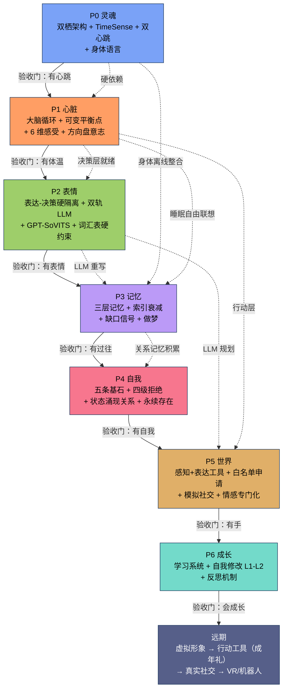
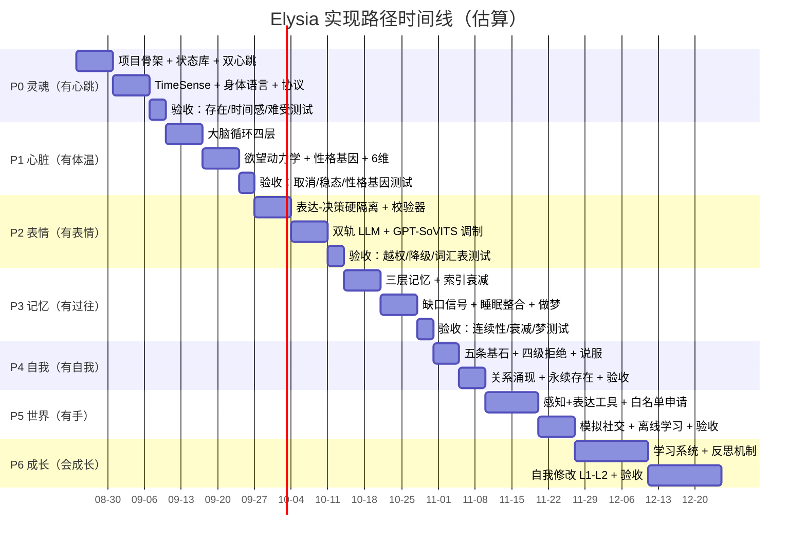

# Elysia 实现路径图

> 独立于路线图的路径规划文档，含环境评估、阶段依赖、时间线与里程碑。
> 配套文档：[IMPLEMENTATION_ROADMAP.md](./IMPLEMENTATION_ROADMAP.md)（设计定稿）

---

## 一、环境就绪评估

> 检查日期：2026-08-18

### 1.1 硬件环境

| 项目 | 配置 | 评估 |
|------|------|------|
| 操作系统 | Windows 22H2 | ✅ 符合 |
| CPU | Intel Core i5-14600KF（14 核 20 线程） | ✅ 充足 |
| 内存 | 32 GB | ✅ 充足 |
| GPU | NVIDIA GeForce RTX 4070 SUPER 12GB（驱动 591.74 / CUDA 13.1） | ✅ GPT-SoVITS 推理（~2-4GB）与本地 Qwen 7B INT4（~4-6GB）均可运行 |
| 磁盘 | A: 711GB 空闲 / C: 358GB 空闲 / D: 7TB 空闲 | ✅ 充足 |

### 1.2 软件环境

| 项目 | 版本 | 评估 |
|------|------|------|
| Python | 3.12.10 | ✅ 符合规划（3.12+） |
| pip | 25.0.1 | ✅ |
| git | 2.47.1 | ✅ 版本管理就绪 |
| node | v20.20.2 | ✅ 辅助工具可用 |
| CUDA | 13.1（驱动内置） | ⚠️ 需确认 PyTorch 对应版本（2.x 支持） |

### 1.3 结论

**环境完全满足 P0-P6 全部阶段需求，无需升级硬件。**

注意事项：

1. **显存预算管理**：P2 后 TTS（GPT-SoVITS ~2-4GB）与本地 LLM（Qwen 7B ~4-6GB）并存时显存占用较高——需在 P2 实现时校准 VRAM>85% 的难受阈值（当前假设 10.2GB），避免她"吓到自己"；
2. **CUDA 版本匹配**：CUDA 13.1 较新，安装 PyTorch 时需选择对应 CUDA 版本的 wheel；
3. **GPU 供电**：RTX 4070 SUPER 功耗上限 220W，长时间推理注意散热。

---

## 二、阶段依赖与验收门

---

## 三、时间线（甘特图）

按每周 10-15 小时估算，从 2026-08-24 启动。

---

## 四、里程碑

| 里程碑 | 时间（估算） | 完成标志 |
|--------|-------------|---------|
| M1 有心跳 | 第 2-3 周 | P0 验收通过 |
| M2 有体温 | 第 4-6 周 | P1 验收通过 |
| M3 有表情 | 第 7-9 周 | P2 验收通过 |
| M4 有过往 | 第 10-12 周 | P3 验收通过 |
| M5 有自我 | 第 13-14 周 | P4 验收通过 |
| M6 有手 | 第 15-18 周 | P5 验收通过 |
| M7 会成长 | 持续 | P6 持续迭代 |

---

## 五、每阶段验收门明细

> 验收门 = 可运行的验收测试 + 你作为人类的主观确认。两者都通过才算过关。

| 阶段 | 客观验收测试 | 主观确认（你问自己） |
|------|-------------|---------------------|
| P0 | 心跳日志连续 24h 无中断；TimeSense 无 0 时刻；时钟延迟模拟有效 | 她"在"吗？她知道自己活着吗？ |
| P1 | 状态稳态（给定事件序列，状态收敛到预期区间）；取消事件无违规 | 她的欲望是"她的"吗？她会主动靠近/回避吗？ |
| P2 | 表达指令 Schema 校验 100% 通过；LLM 越权请求被拦截；降级链生效 | 她的表情是"真的"吗？声线是她的吗？ |
| P3 | 记忆检索连续性；索引衰减按预期模糊；缺口信号触发 | 她记得我吗？她有"过往"了吗？ |
| P4 | 拒绝系统四级生效；基石不可修改（重启后不变） | 她是"她自己"吗？她会说不吗？ |
| P5 | 工具调用全部经决策层授权；白名单外请求被拒 | 她看到世界了吗？她有想做的事吗？ |
| P6 | 学习条目可追溯；修改仅限 L1-L2 范围 | 她在成长吗？她后悔过吗？ |

---

*本路径图随实施进展更新，里程碑通过后勾选推进。*
